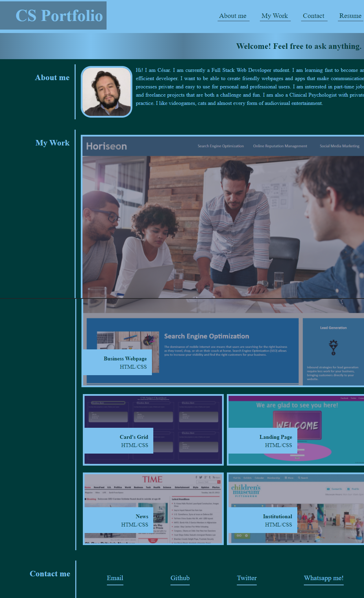

# Homework-week3
Advanced CSS: Portfolio

The task was to build a Webpage to include a portfolio of my work from zero. It specially had to be adequately formatted to be accesible. 

In order to achieve this the HTML structure was built to resemble the example.
Then, the css formatting was done with normal pc screens in mind.
After that, it was necessary to make adjustments to be accesible from different devices. Finally, after a couple of adjustments, it was finished.

 [Final Product:Github repository](https://github.com/csancheze/Homework-week3)

 [Final Product:Portfolio](https://csancheze.github.io/Homework-week3/)
