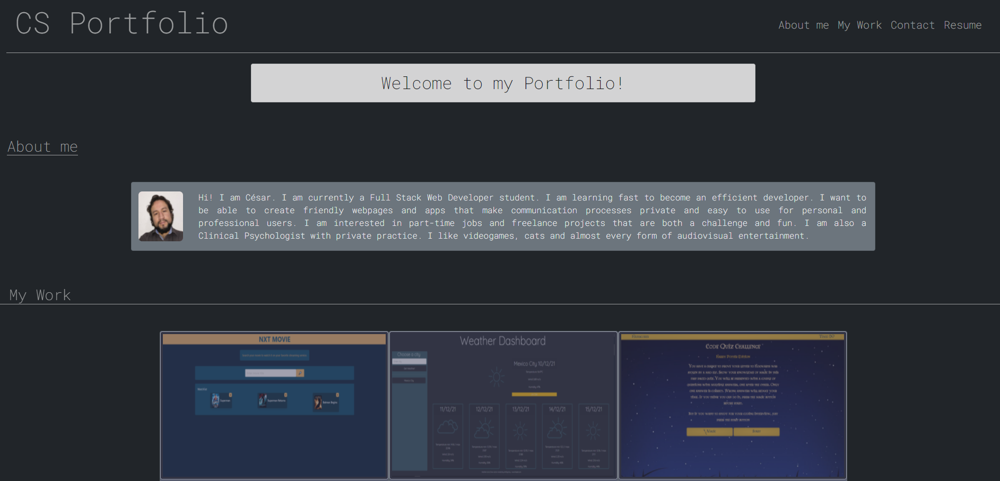

# Updated Portfolio
Updated Portfolio

by Cesar San

Contact me cesanchezesc@gmail.com

The task was to build a Webpage to include a portfolio of my work from zero. It specially had to be adequately formatted to be accesible. 

In order to achieve this the HTML structure was built to resemble the example.
Then, the css formatting was done with normal pc screens in mind.
After that, it was necessary to make adjustments to be accesible from different devices. Finally, after a couple of adjustments, it was finished.

For the Update, a copy of the original repository was made. 

Must of the old Css was deleted and started working with Bootstrap and CSS to make a responsive design for mobile first. Then adjustments were added in CSS for a good look on wider screens.

After must of the style was done, the newer projects were added. Some of the HTML was also changed to add some icons to the contact information and to use some bootstrap components correctly.

A google font was added at the end along with some style corrections for it to look correctly.

Tecnologies used:
-HTML.
-CSS.
-Bootstrap.
-Google Fonts.
-Font Awesome

 [Final Product:Github repository](https://github.com/csancheze/Portfolio/)

 [Final Product:Portfolio](https://csancheze.github.io/Portfolio/)
 
 Copyright (c) [2022] [Cesar San]

Permission is hereby granted, free of charge, to any person obtaining a copy of this software and associated documentation files (the "Software"), to deal in the Software without restriction, including without limitation the rights to use, copy, modify, merge, publish, distribute, sublicense, and/or sell copies of the Software, and to permit persons to whom the Software is furnished to do so, subject to the following conditions:

The above copyright notice and this permission notice shall be included in all copies or substantial portions of the Software.

THE SOFTWARE IS PROVIDED "AS IS", WITHOUT WARRANTY OF ANY KIND, EXPRESS OR IMPLIED, INCLUDING BUT NOT LIMITED TO THE WARRANTIES OF MERCHANTABILITY, FITNESS FOR A PARTICULAR PURPOSE AND NONINFRINGEMENT. IN NO EVENT SHALL THE AUTHORS OR COPYRIGHT HOLDERS BE LIABLE FOR ANY CLAIM, DAMAGES OR OTHER LIABILITY, WHETHER IN AN ACTION OF CONTRACT, TORT OR OTHERWISE, ARISING FROM, OUT OF OR IN CONNECTION WITH THE SOFTWARE OR THE USE OR OTHER DEALINGS IN THE SOFTWARE.
